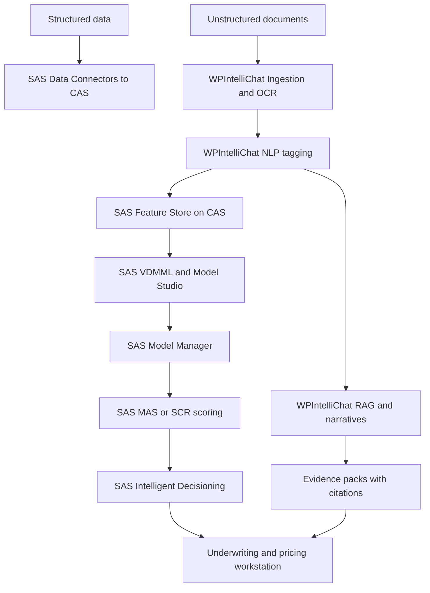
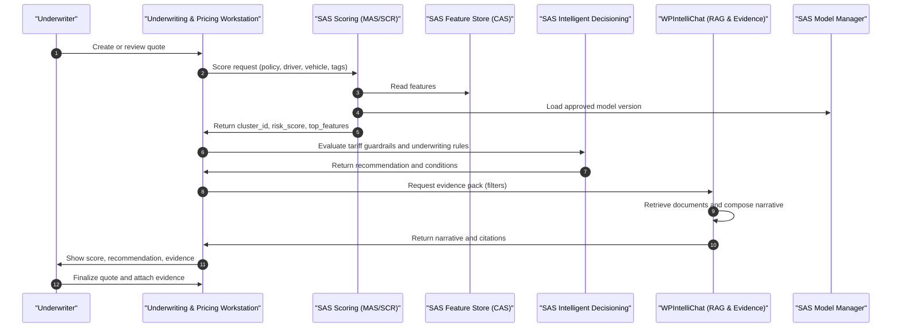

# High-Level Design — Five-Step Solution (SAS + WPIntelliChat)
**Scope:** This document presents only the five-step solution from the source concept. It consolidates product choices to **SAS Viya** for ML and **WPIntelliChat** for AI (NLP, RAG, narratives, evidence).

**Audience:** Actuaries, Underwriters, Product, Compliance, Data/ML, Engineering  
**Version:** 1.1 (Five‑Step Only)

---

## 1) Data Collection
**Objective:** Consolidate structured and unstructured data for downstream AI and ML.

- **Inputs**  
  - Structured: policies, claims, demographics, vehicle, geography, expenses, reinsurance.  
  - Unstructured: claim notes, repair invoices, agent logs, emails.
- **Products & Responsibilities**  
  - **SAS**: Data Connectors and CAS for landing data (bronze, silver, gold).  
  - **WPIntelliChat**: Read‑only ingestion adapters for documents (with OCR if needed) and metadata normalization.
- **Outputs**  
  - Conformed CAS tables (structured).  
  - Normalized document text and metadata ready for enrichment.

---

## 2) AI / GenAI Enrichment (NLP)
**Objective:** Extract explainable, regulator‑safe signals from unstructured text and make them ML‑ready.

- **Capabilities**  
  - NER and keyphrases: driver context, vehicle modifications, incident descriptors, fraud cues.  
  - Lightweight tagging: severity band, incident type, recurring agent or garage.
- **Products & Responsibilities**  
  - **WPIntelliChat**: NLP tagging service; tag persistence with provenance.  
  - **SAS**: Feature Store (CAS) receives tags as first‑class features.
- **Outputs**  
  - Feature tables in SAS Feature Store, traceable back to original text.

---

## 3) ML Clustering and Risk Scoring
**Objective:** Form micro‑segments and compute risk per segment within tariff boundaries.

- **Capabilities**  
  - Clustering to micro‑buckets.  
  - Risk score per bucket: expected frequency × severity × expense.
- **Products & Responsibilities**  
  - **SAS**: Viya Visual Data Mining and Machine Learning (VDMML) and Model Studio for feature pipelines and clustering.  
  - **SAS**: Model Manager for lifecycle governance.
- **Outputs**  
  - Cluster assignments and risk scores persisted to gold tables and scoring artifacts.

---

## 4) Explainability Layer (Narratives and Citations)
**Objective:** Provide regulator‑friendly justifications and on‑demand evidence grounded in internal data.

- **Capabilities**  
  - RAG Q&A over normalized documents.  
  - Narrative generator with citations to internal sources.
- **Products & Responsibilities**  
  - **WPIntelliChat**: RAG service, narrative generation, evidence pack export.
- **Outputs**  
  - Short explanations per cluster or quote, with source snippets and links.

---

## 5) Deployment to Pricing and Underwriting
**Objective:** Operationalize risk and evidence in the underwriting workstation while complying with tariffs.

- **Capabilities**  
  - Real‑time scoring and business rules, plus attachable evidence packs.  
  - Audit trails for decisions and explanations.
- **Products & Responsibilities**  
  - **SAS**: Micro Analytic Service (MAS) or SAS Container Runtime (SCR) for low‑latency scoring; Intelligent Decisioning for rules; Model Manager for governance.  
  - **WPIntelliChat**: Evidence service in the workstation for narratives and citations.
- **Outputs**  
  - Underwriter view combining score, recommended action within tariff, and attached evidence pack.

---

## Architecture Diagram (Mermaid)

---

## Workflow Diagram (Mermaid)

---

## Interfaces (Narrative)
**Integration principle:** SAS owns ML features, clustering, scoring, and decision logic; WPIntelliChat owns NLP tagging, retrieval‑augmented narratives, and evidence packs. The underwriting workstation orchestrates both.

**Data sharing (WPIntelliChat → SAS):** WPIntelliChat writes derived NLP tags (e.g., aftermarket_mod, low_speed_pattern, recurring_agent/garage, incident_type, severity_band) into SAS Feature Store (CAS). Contract: stable schemas, a published data dictionary, and provenance per tag (source document, timestamp, hash). Update cadence aligns with nightly enrichment; urgent updates supported on‑demand.

**Scoring (Workstation ↔ SAS):** At quote time, the workstation requests a score from SAS (MAS/SCR). Contract: request contains the quote context (policy, driver, vehicle, geo, usage) plus references to available tags/features; response returns cluster identifier, risk score/decile, expected loss, and top contributing features. Latency budget is sub‑300ms p95. Idempotency is maintained via unique request IDs and replay protection.

**Decisioning (Workstation ↔ SAS Intelligent Decisioning):** After scoring, the workstation asks SAS Intelligent Decisioning to evaluate tariff guardrails and business rules. Contract: input includes scoring summary and tariff context; output provides an action (e.g., below‑ceiling vs at‑ceiling), indicative price within caps, and any underwriting conditions. Decisions are versioned and approved through SAS governance; rationale text is persisted for audit.

**Evidence (Workstation ↔ WPIntelliChat):** The workstation requests an evidence pack from WPIntelliChat using contextual filters (vehicle class, region, period). Contract: deliverable is a short narrative grounded in internal documents with citations/snippets; optional redaction policies (PII, policy IDs) apply. The pack is attached to the quote record; retention and access follow compliance policy.

**Security & auth:** Enterprise SSO/OAuth2 or mTLS as per platform standards; tenant‑aware scoping; correlation IDs on all calls. PII masking occurs before any text is indexed by WPIntelliChat. Both products enforce least‑privilege roles.

**Versioning & change management:** Semantic versions on models, rules, and schemas. Backward‑compatibility windows are maintained for interface changes. A schema registry and deprecation calendar are communicated to all integrators.

**Observability & audit:** Correlated request IDs across workstation, SAS, and WPIntelliChat. SAS tracks model lineage, approvals, and deployments; WPIntelliChat logs retrieval sources and narrative composition metadata. Key events (score requested, decision rendered, evidence attached) are emitted to a central audit stream.

**Failure modes & fallbacks:**
- If scoring exceeds SLO, the workstation applies conservative rules‑only defaults and flags the quote for later review.
- If evidence generation is delayed, underwriting proceeds with score/decision and attaches the pack asynchronously when ready, preserving the audit trail.
- Circuit breakers prevent cascading failures; health checks determine routing to active instances.

**SLAs (targets):** Scoring p95 ≤ 300ms; Decision evaluation p95 ≤ 400ms; Evidence retrieval p95 ≤ 1.5s (k≤10). Operations KPIs include index freshness ≤ 24h and model refresh on a governed cadence.

---

## Governance, Security, and NFRs
- **Security and Privacy:** PII masking before indexing; RBAC and ABAC; encryption in transit and at rest.  
- **Auditability:** Model lineage and change logs (SAS); query and citation logs (WPIntelliChat).  
- **Performance Targets:** p95 scoring ≤ 300 ms; p95 RAG retrieval ≤ 1.5 s for k ≤ 10; index refresh ≤ 24 h.
